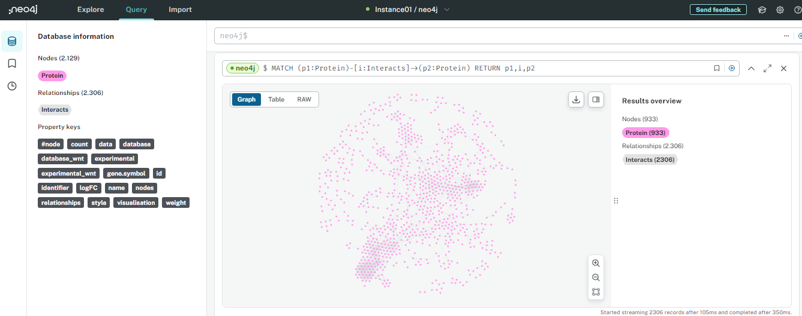
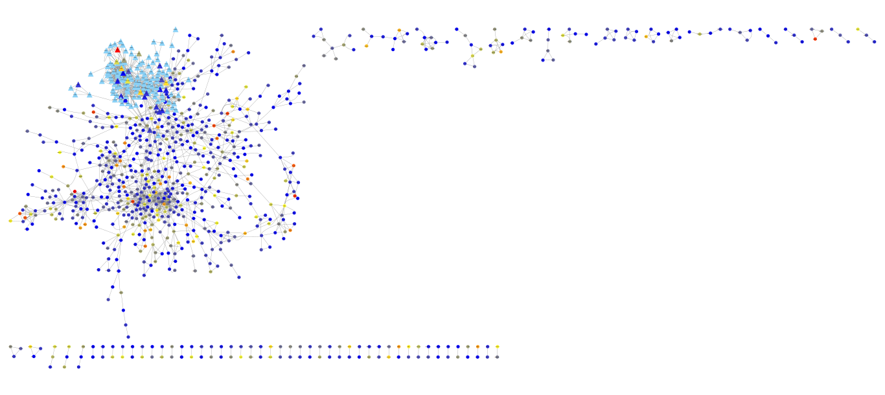

# Ciência e Visualização de Dados em Saúde

MO413-MC936 - 2024/1

## Relatório do trabalho T2 - Integrando Redes

## Equipe Get Out Zika

> | Nome  | RA (e-mail) | Especialização|
> |--|--|--|
> | Bruno Brito Pereira da Silva | b213947 (@dac.unicamp.br) | Biologia |
> | Márcio Silva Cruz | m290232 (@g.unicamp.br) | Computação |
> | Rafael Simionato  | r066505 (@g.unicamp.br) | Computação |

## Metodologia

Utilizamos a funcionalidade do <i>Multiple proteins</i> do <i>STRING</i> para encontrar as interações entre as proteinas disponíveis no arquivo <code>most-differentially-expressed-genes.csv</code>. Com isso descarregamos o arquivo de arestas do grafo gerado com informações a respeito das interações físicas documentadas:
- <i>network type: physical subnetwork</i>
- <i>meaning of network edges: confidence</i>
- <i>active interaction sources: experimental e database</i>

Realizamos um procedimento similar buscando pela funcionalidade <i>Pathway</i> a rede de interações disponível na base de dados KEGG para o <i>Wnt Signaling Pathway</i>. Neste caso descarregamos os arquivos de nós e arestas do grafo gerado contendo informações a respeito das interações físicas documentadas por confidence, experimental e database, e por fim, combinamos todos os dados no Neo4j.

No Neo4j descrevemos um modelo lógico de interação Proteína-Proteína para realizar a importação das redes. A fim se de evitar sobrescrever-se os valores das propriedades <code>experimental</code> e <code>database</code> nas arestas criadas na importação do primeiro arquivo, acrescentamos um sufixo <code>_wnt</code> às propriedades citadas na importação do segundo arquivo. Em seguida obtivemos uma rede com 2.129 nós <i>Protein</i> e 2.306 relacionamentos <i>Interacts</i> conforme a figura 1.

Figura 1 - Rede de interação Proteína-Proteína no Neo4j 

Uma vez juntados os grafos, exportamos a rede consolidada para um arquivo CSV a ser utilizado no Cytoscape. <b>Importante</b> mencionar que neste arquivo constam apenas as proteínas que interagem entre si (933 proteínas - figura 1) na rede agregada.

Em seguida, no Cytoscape utilizamos a funcionalidade para importação de redes a partir de arquivos. Assim definimos os nós <code>source</code> e <code>target</code> atribuindo a eles as propriedades <code>logFC</code> e <code>wnt</code>.

A fim de se evidenciar as proteínas (nós) participantes do <i>Wnt Signaling Pathway</i>, unificamos as propriedades <code>experimental_wnt</code> e <code>database_wnt</code> em um tipo booleano. Utilizamos essa nova propriedade <code>wnt</code> para diferenciar os genes do <i>pathway</i> por forma (triangular) e tamanho. Evidenciou-se também os nós com valor de expressão diferencial (propriedade <code>logFC</code>) através de uma escala de cores variando de azul (baixa expressão) a vermelho (alta expressão) conforme figura 2.

Figura 2 - Rede de interação Proteína-Proteína no Cytoscape